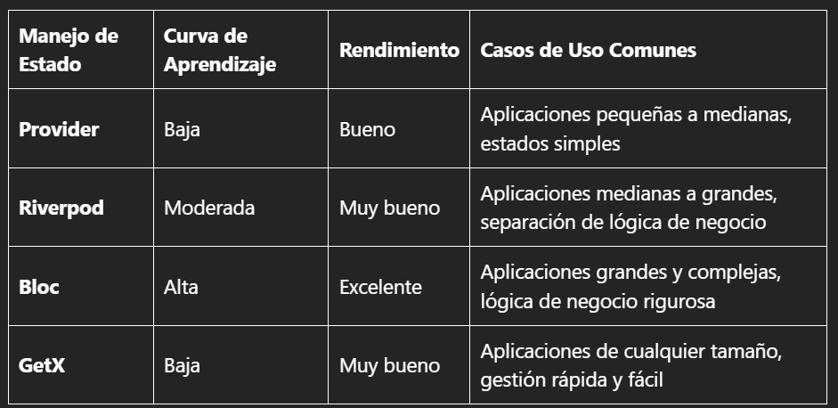

# Proyectos Flutter

Proyectos Flutter creados en clase del curso **Lenguaje de Programación V**

## Información de los proyectos

- **01/app_lab01**: Plantilla inicial (contador)
- **02/app_lab02**: Widgets Row, Column, Stack, Align, Text, Icon, Expanded, Padding, ElevatedButton, ListView, TextField
- **02/app_lab02b**: Widgets ListView, GridView, Listview.builder, Gridview.builder
- **02/app_lab02c**: Widgets Button
- **03/app_lab03**: Navegación entre páginas
- **04/app_lab04**: Uso de provider, Inherit Widget
- **05/app_lab05**: Widget GestureDetector
- **06/app_lab06**: Ciclo de vida de los widgets
- **07/app_lab07**: Formularios: Checkbox, DateTimePicker, Form, RadioButton, Switch, Validaciones
- **08/app0x_xxxx**: 5 Apps de demostración
- **09/app_lab09**: Consumo de Api Rest
- **10/app_lab10**: Local Storage (SharedPreferences, Flutter Secure Storage, Hive, SQLite)
- **11/app_lab11**: Manejo de estados (Provider, Riverpod, Bloc, GetX)

- **12/app_lab12**: Notificaciones Local
- **12/app_lab12_push**: Notificaciones Push [Firebase Console](https://console.firebase.google.com/)

A few resources to get you started if this is your first Flutter project:

- [Lab: Write your first Flutter app](https://docs.flutter.dev/get-started/codelab)
- [Cookbook: Useful Flutter samples](https://docs.flutter.dev/cookbook)

For help getting started with Flutter development, view the
[online documentation](https://docs.flutter.dev/), which offers tutorials,
samples, guidance on mobile development, and a full API reference.